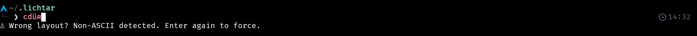
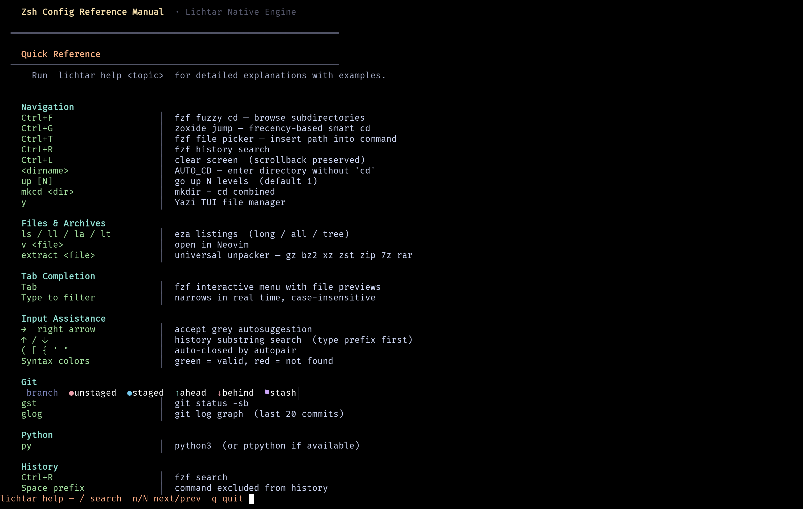
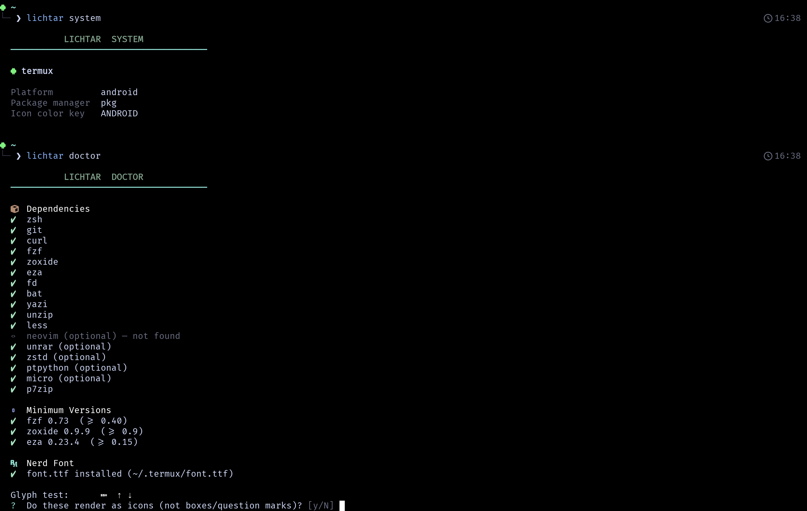
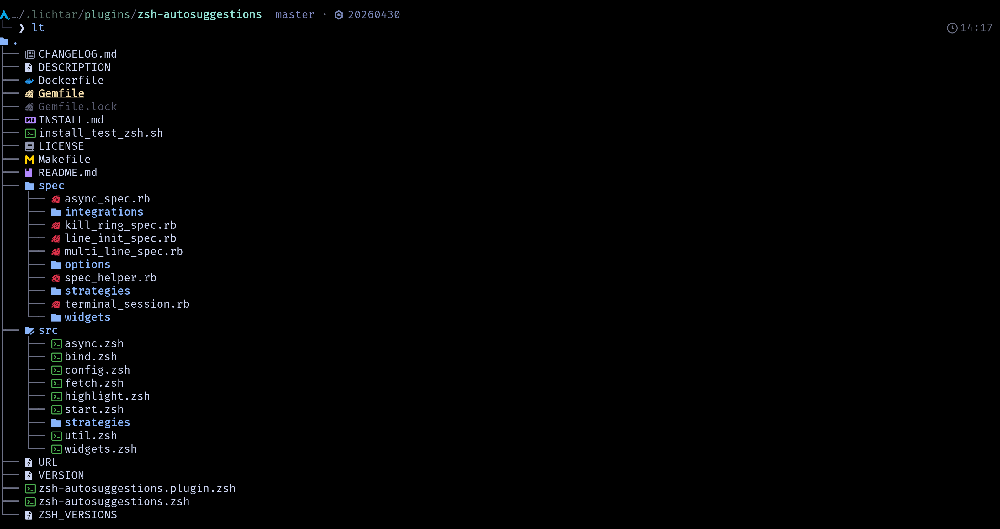
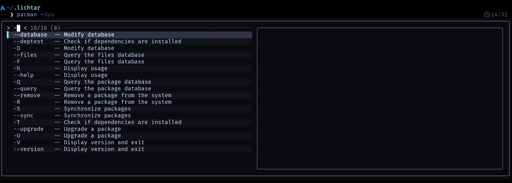

# lichtar

A personal zsh configuration framework — built for Termux/Android with, and expanding to standard Linux distributions. Arch
Linux is the first confirmed non-Android target.

**Everything lives in one self-contained folder: `~/.lichtar`.** Nothing
touches `/etc`, no system-wide files, no scattered dotfiles. That makes
lichtar trivial to inspect, back up, move between machines, or remove
completely — see [Uninstalling](#uninstalling).

## Features

- Frequency-ranked `Ctrl+R` history search — not just chronological,
  ranks by how often you actually use a command
- Distro-aware prompt: platform, icon and color auto-detected and cached
  (`lichtar system`)
- `fzf`-powered directory jump, file picker, history search
- `zoxide` smart `cd`, `yazi` file manager with cd-on-exit
- Non-ASCII / wrong-keyboard-layout guard on the command line —
  catches an accidental layout switch before it runs as a command:

  

- Catppuccin Mocha theme across zsh, `bat`, `eza`, `fzf`,
  fast-syntax-highlighting, and yazi — one theme file drives all of them
- `lichtar doctor` — full environment check with platform-correct fix
  suggestions; `lichtar update` — updates itself and all plugins

Run `lichtar help` after installing for the full reference.

## Screenshots

<table>
<tr>
<td><br><sub><code>lichtar help</code></sub></td>
<td><br><sub><code>lichtar system</code> / <code>lichtar doctor</code> on Termux</sub></td>
</tr>
<tr>
<td><br><sub>git branch/status in the prompt (Arch) — <code>lt</code> inside <code>plugins/zsh-autosuggestions</code></sub></td>
<td><br><sub>fzf-tab completion — <code>pacman</code> + Tab (Arch)</sub></td>
</tr>
</table>

Click any image for full resolution.

## Supported systems

| Platform                                       | Status                                                               |
| ---------------------------------------------- | -------------------------------------------------------------------- |
| Termux / Android                               | Fully supported, primary target                                      |
| Arch Linux (incl. ARM / proot-distro)          | Fully supported                                                      |
| Debian, Ubuntu, Fedora, openSUSE, Alpine, Void | Detected and architecturally supported — not yet verified end-to-end |

## Prerequisites

Install these yourself, however's convenient on your system — lichtar's
installer checks what's missing and prints the right command for your
package manager, but never installs anything or calls `sudo` for you.

**Required:** `zsh` `git` `curl` `yazi` `fzf` `zoxide` `eza` `fd` `bat`
`unzip` `p7zip` `less`

**Optional:** `micro` `neovim` `unrar` `zstd` `ptpython` `openssh`

(Full explanation of what each one is used for: `lichtar help install`
after installing, or see `.lichtar/help/lichtar_help.zsh` in this repo.)

## Install

```sh
git clone https://github.com/linston/lichtar ~/.lichtar
~/.lichtar/bin/install.sh
```

Re-running `install.sh` any time is safe — it only fills in what's
missing (plugins, `.zshrc`, font, default shell). Nothing already in
place is overwritten without asking first.

Add `-y` to skip prompts (the `.zshrc` overwrite prompt is never
skipped, even with `-y`):

```sh
~/.lichtar/bin/install.sh -y
```

Then restart your terminal, or run `exec zsh`.

## Configuration

```sh
cp ~/.lichtar/.env.example ~/.lichtar/.env
```

Edit `~/.lichtar/.env` — it's your personal config, gitignored, never
touched by `install.sh` or `lichtar update`. See it or
`lichtar help config` for all available flags.

## Updating

```sh
lichtar update
```

Pulls the latest lichtar itself (since `~/.lichtar` is a real git
checkout) and updates all zsh plugins in one go.

## Checking your setup

```sh
lichtar doctor    # full environment check, suggests fixes
lichtar system    # shows detected platform/distro/package-manager/icon
```

## Uninstalling

Everything lichtar touches lives in `~/.lichtar` and one line in
`~/.zshrc`. To remove it:

1. Replace the lichtar block in `~/.zshrc` with whatever shell config
   you want instead (or restore a backup — `install.sh` saves one as
   `~/.zshrc.lichtar-backup-<timestamp>` whenever it replaces an
   existing `~/.zshrc`).
2. Delete the folder:

   ```sh
   rm -rf ~/.lichtar
   ```

That's it — no leftover system files anywhere.

## Documentation

`lichtar help` — full in-shell reference, paginated. `lichtar help -l`
lists every topic; `lichtar help <topic>` opens one directly.
`lichtar changelog` — what changed, paginated.
